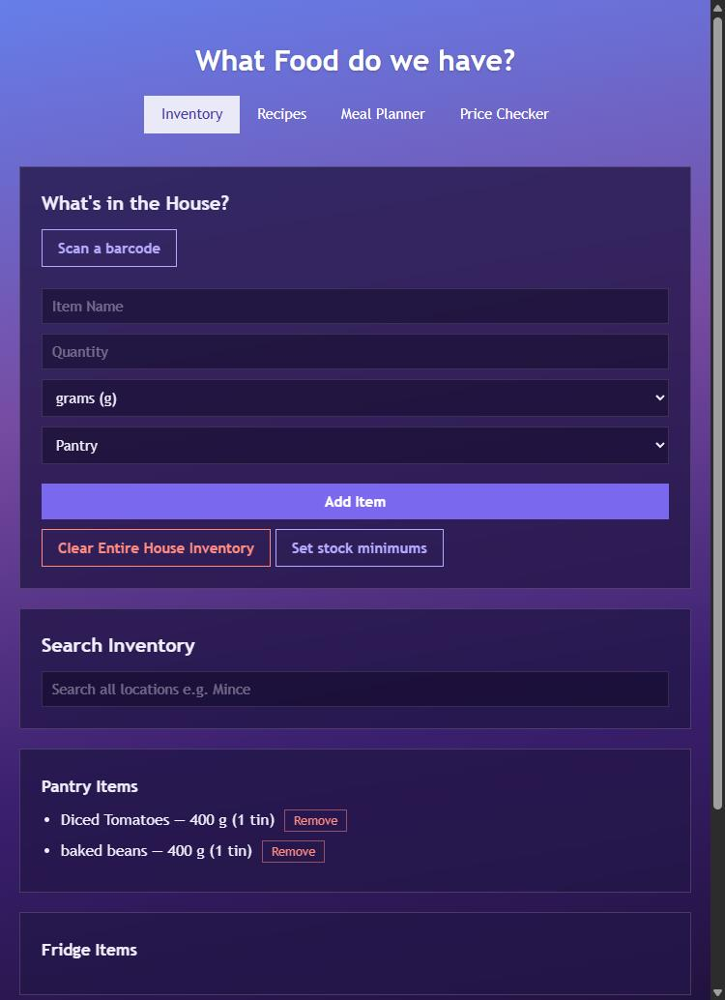
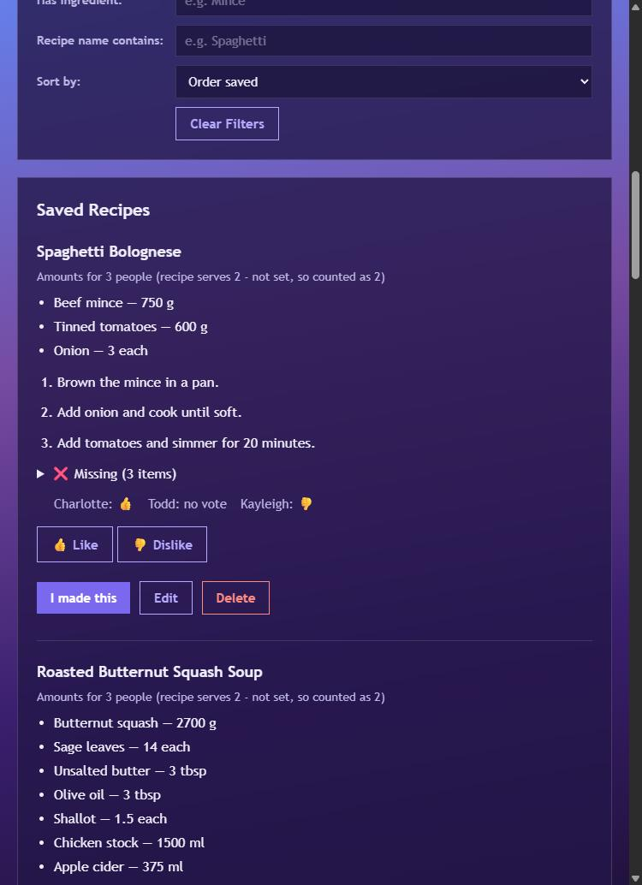
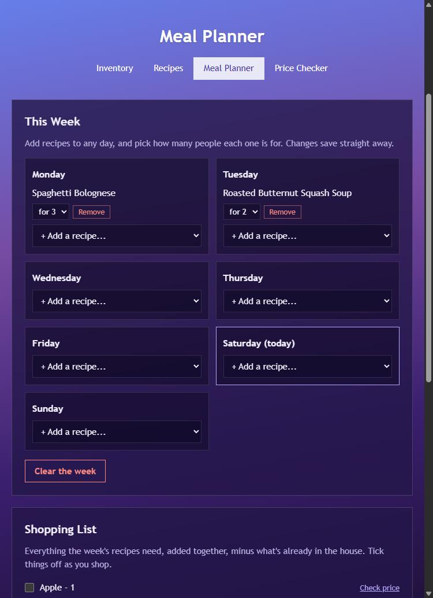
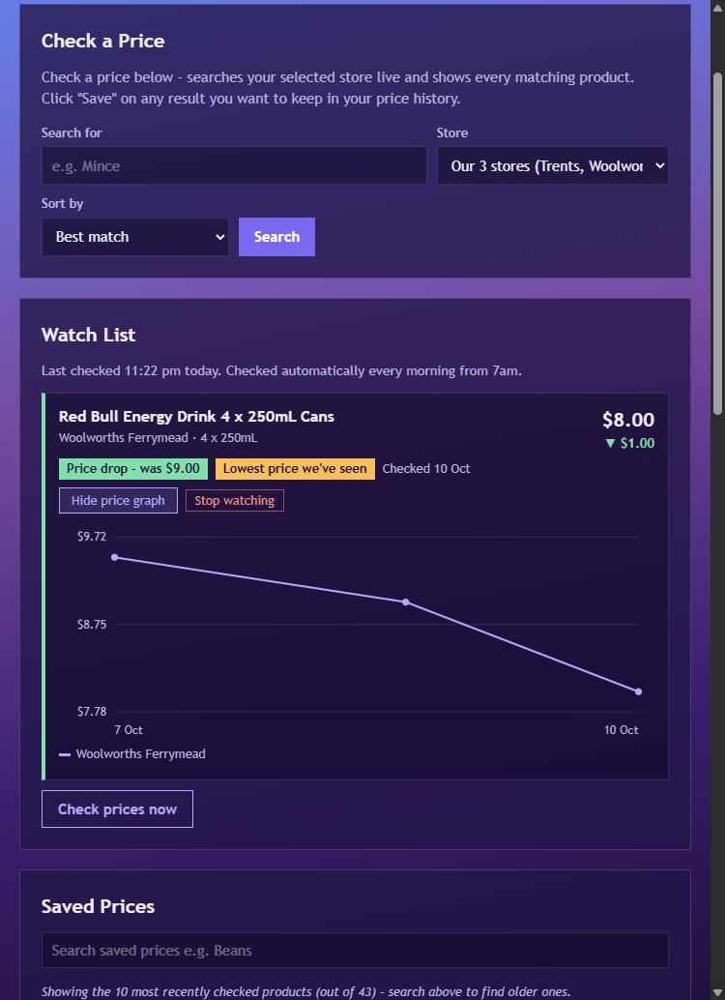

# Ingredients_And_Recipes

This is intended to help with a couple of issues:
1: I live with my boyfriend and also at my own house. We have two pantries, multiple freezers, and lots of food, especially in the freezer. We want to start buying in bulk as well as tracking what we have more accurately.

2: We also have different food tastes and allergies in the house, we want to make sure on days that we have my boyfriends daughter that recipes don't include eggs or gluten, but on days that we are just me and boyfriend we can have this food.

3: We also want to track preferences, so boyfriend and his daughter and I can track what we like, and start filtering by recipes we like.

4: We also want to start tracking and checking prices against the common supermarkets we go to (Pak n Save, Trents, Woolworths) to optimise our shopping

---

## What it looks like

| Inventory | Recipes |
|---|---|
|  |  |

| Meal Planner | Price Checker |
|---|---|
|  |  |

*(Screenshots are from a local test copy, so the prices shown are test data.)*

## What it does

**Inventory**
- Tracks what's in the pantry, fridge, inside freezer and chest freezer. Amounts are stored in grams / millilitres / each, so "2 kg" and "500 g" of the same thing add together.
- Tins are understood ("3 tins of chickpeas" = 1.2 kg), and tinned goods show how many tins that is.
- Scan a product's barcode with your phone camera to fill in the form. Products are looked up on [Open Food Facts](https://world.openfoodfacts.org), and the app remembers the name you used for each barcode.
- Remove single items, with an Undo button for a few seconds after any change.
- Optional stock minimums ("always want 2 tins of tomatoes") with a Running Low list.

**Recipes**
- Recipes with any number of ingredients, typed in, uploaded as a text file, or **imported from a link** to almost any recipe website.
- Each recipe is checked against everything in the house. Ingredient aliases (e.g. "ground beef" = "mince", US to NZ names) mean different wording still matches.
- "Cooking for 1 / 2 / 3 people" scales every recipe's amounts.
- Sort by "What can I make now?" (fewest missing ingredients first).
- Like/dislike votes per person, and filters.
- **I made this** takes the ingredients out of stock (fridge first), with an editable preview.

**Meal Planner**
- Pick recipes for each day of the week. It builds one combined shopping list, minus what's already in the house, with tick boxes and a "Copy list" button.

**Price Checker**
- Live price searches at Woolworths, PAK'nSAVE and Trents Wholesale (or all three at once), sortable by price or unit price.
- Saved price history grouped by product across stores, with a price graph.
- **Watch list**: star a product and the server re-checks its price every morning by itself. It shows "Price drop" and "Lowest price we've seen" badges.

**Behind the scenes**
- A simple first-name login, remembered per browser for a year.
- An activity log (`activity_log.csv`) of who changed what, e.g. "Todd, Used (I made this), Mince, 500 g, Fridge".
- A nightly backup of all the data.

## How it's built

- **No framework.** Plain HTML, CSS and JavaScript pages, and one Node.js server (`server.js`) using Node's built-in `http` module.
- **Data is stored in CSV files** (one per storage area, recipes, prices and so on). Every save goes through a one-at-a-time queue and a write-to-temp-then-rename step, so two people saving at once, or a restart mid-save, can't corrupt a file. Moving to PostgreSQL is planned.
- **The supermarket scrapers use [Playwright](https://playwright.dev)**. They open a real Chromium browser, run the search on the store's own website, and read the prices out of the website's own data requests. Trents needs a real account login.
- **Recipe import** reads the hidden `schema.org/Recipe` data that recipe websites embed for Google. It then converts each ingredient line ("1 1/2 cups plain flour") into the app's name / quantity / unit format.

| File | What it is |
|---|---|
| `server.js` | The whole back end: data files, login, scrapers, recipe import, meal plan, watch list |
| `ingredient-data.js` | Built-in ingredient aliases (US to NZ names etc.) and tin sizes |
| `index.html` / `script.js` | Inventory page |
| `recipes.html` / `recipes.js` | Recipes page |
| `planner.html` / `planner.js` | Meal Planner page |
| `price-checker.html` / `price-checker.js` | Price Checker page |
| `login.html` / `login.js` / `auth.js` | Login page, and the check every page runs first |
| `undo-toast.js` | The "Removed Rice - Undo" message |
| `style.css` | All the styling |
| `backup-data.sh` | Nightly backup script for the server |

## Running it locally

You need [Node.js](https://nodejs.org) 18 or newer.

```bash
npm install
npx playwright install chromium
```

Then create the files that are deliberately **not** in the repo (they're in `.gitignore`):

**1. `credentials.js`** holds the Trents Wholesale login. It's only needed for Trents searches, but the server expects the file to exist:

```js
// NEVER commit this file - it's in .gitignore.
module.exports = {
    TRENTS_USERNAME: 'your-trents-login@example.com',
    TRENTS_PASSWORD: 'your-trents-password'
};
```

**2. The data files.** Each one needs at least its header row. The rest are created automatically when first used.

| File | Header row |
|---|---|
| `pantry.csv`, `fridge.csv`, `freezer.csv`, `chest.csv` | `name,quantity,unit` |
| `recipes.csv` | `id,name,instructions,servings` |
| `recipe_ingredients.csv` | `recipe_id,ingredient_name,quantity,unit` |
| `recipe_votes.csv` | `recipe_id,person,vote` |

Created automatically: `prices.csv`, `ingredient_aliases.csv`, `stock_minimums.csv`, `barcodes.csv`, `meal_plan.csv`, `watch_list.csv`, `activity_log.csv`, `sessions.json`, `watch_check_status.json`.

**3. `dev-server.js`** is a small local-only launcher. On the real server a web server sits in front of `server.js`: it serves the pages and passes anything starting with `/recipes/` through to `server.js` (port 3000) with that prefix removed. `dev-server.js` does the same job on port 8080 and starts `server.js` for you:

```bash
npm run dev
```

Then open <http://localhost:8080>. The login is a household member's first name as both the username and password (see `HOUSEHOLD_MEMBERS` in `server.js`).

## How it runs at home

The live copy runs on a small Linux server in the garage, at `/opt/Ingredients_And_Recipes`, set up with systemd:

- **`ingredients-recipes.service`** runs `server.js`. It runs under `xvfb-run`, which gives the scrapers' browser a virtual screen. A web server in front of it serves the pages and proxies `/recipes/` to it.
- **`ingredients-recipes-update.timer`** deploys every hour. It fetches from GitHub, runs `git reset --hard origin/main` and `git clean -fd`, then restarts the service. Because the data files are gitignored, a deploy never touches them.
- **`pantry-backup.timer`** runs `backup-data.sh` every night at 3am. It zips every data file into `/opt/pantry-backups/pantry-YYYY-MM-DD.tar.gz` and keeps 30 days. Restore steps are at the top of the script.
- **The watch list's morning price check** runs inside `server.js` itself, from 7am NZ time. It needs no extra timer.
